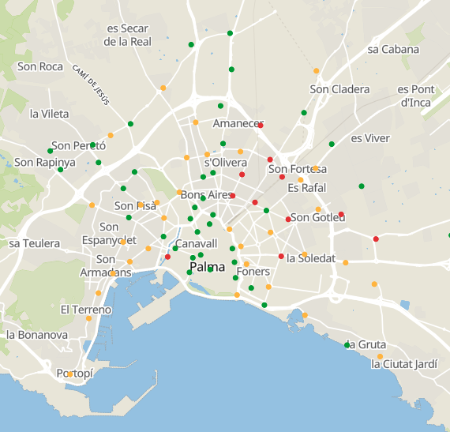
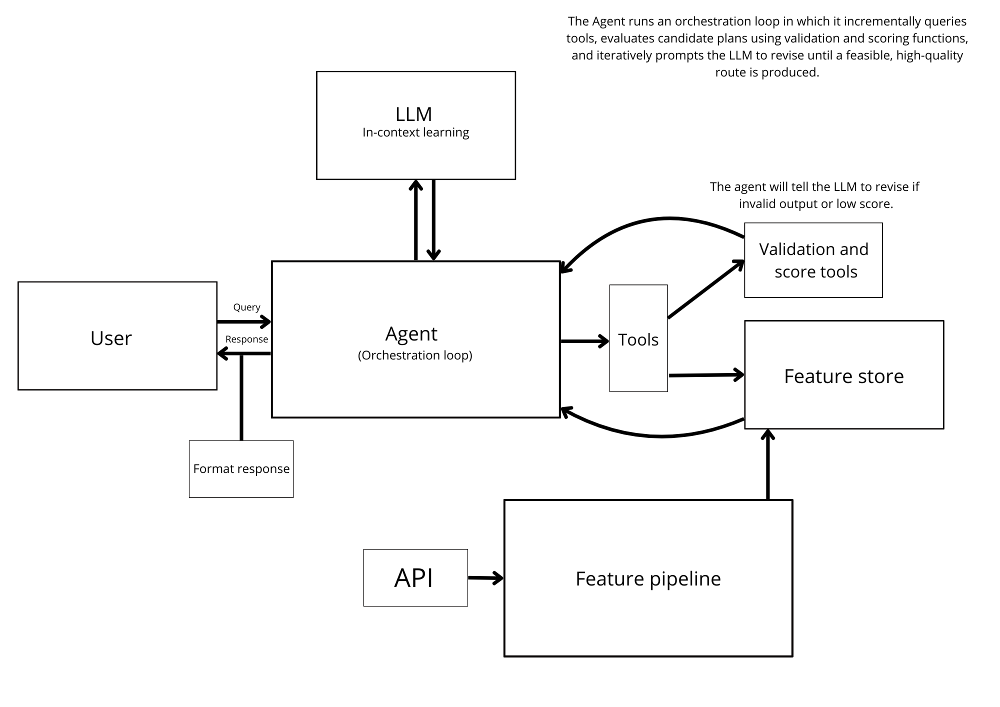

# citybike-rebalancing-agent
Check out our live demo here:
**[Demo Webpage](https://huggingface.co)**


## Overview
In this project we have created an agent which plans how citybikes should be moved by a truckdriver in Palma. We imagine that the truckdriver works for a citybikes company in Palma and can move a certain amount of bikes in his truck. The goal of our planning agent is to work in the same way as a human planner would, by getting info about where the truckdriver is and the availability of bikes at different stations. The planning agent should generate a route for the truckdriver and instructions on how many bikes to pickup and dropoff at every station. The route should make as many stations as possible optimally stacked with bikes, i.e no stations with empty or just a few bikes. We imagine the scenario where the truckdriver requests a new route reasonably often, i.e. once an hour since bike availability changes rapidly. Since we are using an agent we also allow for special requests in the same way a human planning agent would, for example if the driver is soon ending his/her shift he/she might request to end close to a certain location.

While this particular task might not seem optimally suited for an LLM-based agentic framework we still think it suits the purpose of learning to design a scalable agentic framework well. We also see that recently,  LLMs have started being used in more logically demanding domains and think this project could give valuable insight into this process and the pros and cons of using an LLM for such tasks.
**Bike station overview in Palma**



A green dot means the station is full or almost full, a yellow dot means there is only a few bikes remaining, and a red dot means that the bike station is empty.

**Agentic workflow and pipeline overview**
We use the following structure of the agent and feature pipeline.



## LLM and In-context Learning
We use he OpenAIs "gpt-4o-mini" and the LLM use in-context learning.

## Development process and learning outcomes a long the way
The goal was to make incremental updates and create a scalable framework where adding new tools and adapting the framework would be easy. We tried creating indepentend tests of each subpart of the project first, then write the code and make sure the desired behaviour was reached before moving on to the next part. This worked ok, where we in some cases lacked the patience to create tests, in the cases where we created tests we seemed to have less problems.

Initially we thought it would be quite an easy task, considering that designing a not so flexible but reasonably well working heuristic/deterministic path generator would have been easy. But as we would realize designing a robust and flexible agentic framework that actually works is not always straight forward. 


## Setup (to run locally)

1. Create a conda virtual environment:
```
conda create --name cr-agent python=3.10.14
conda activate cr-agent
```
2. Install project dependencies:
```
pip install -r requirements.txt
```
3. Insert Hopsworks and OpenAI API keys into .env (check .env.example for correct format) 
4. Host the website locally by
```
python app.py
```

## Testing

Run individual tests with full output:
```bash
python -m tests.test_llm_hf
python -m tests.test_orchestrator
```

Run all tests using pytest:
```bash
pytest tests/
```

Run tests with verbose output:
```bash
pytest tests/ -v
```

Run a specific test file with pytest:
```bash
pytest tests/test_llm_hf.py -v
```

